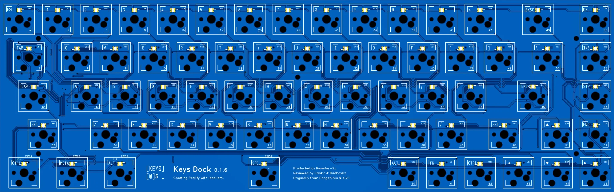

# 

The high performance, feature riched, minimal keyboard!

> [!WARNING]
> **STILL IN EARLY DEVELOPMENT!**
>
> - [ ] PCB design
> - [x] Suitkit design
> - [ ] Firmware
> - [ ] Software
> - [ ] Extended external controllers

## Keys layout

KeysDock uses 67-keys ISO layout.

## Suitkit design

Designed use FreeCAD for 3D modeling and QCAD for nameplate drawn.

Fonts used in design:

- [Iosevka](https://typeof.net/Iosevka/): An elegant monospace coding font;
- [Hershey Fonts](https://en.wikipedia.org/wiki/Hershey_fonts): a collection of vector fonts originally designed to be rendered using vectors on early cathode ray tube displays.

## Hardware design

Designed use [LCEDA](https://lceda.cn/), thanks for the awesome and free EDA design software.

Validated on [QUCS-s](https://ra3xdh.github.io/).

This project uses [Pengzhihui](https://github.com/peng-zhihui)'s shift register solution, which produces higher performance and less I/O usage than normal keyboard.

- MCU: STM32F103CBT6

## Firmware

WIP...

## Software

WIP...

## Credits

The PCB layout design comes from [HelloWord Keyboard by Pengzhihui](https://github.com/peng-zhihui/HelloWord-Keyboard), modified by myself,
and reviewed by several friends [@Badboy2002](https://github.com/Badboy2002/) and [@HankZ](https://github.com/HankZhangZ/).
