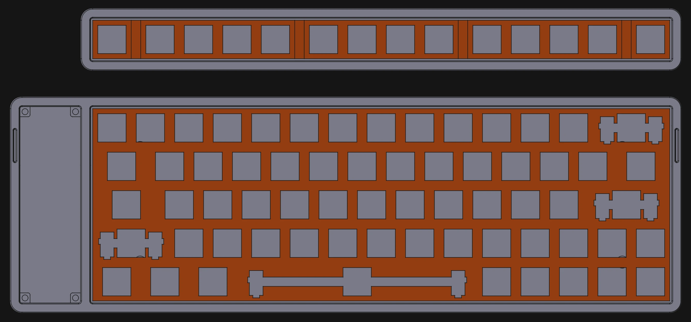

# 

The hall-effect powered, high performance, feature riched, minimal keyboard!

> [!WARNING]
> **STILL IN EARLY DEVELOPMENT!**
>
> - [ ] PCB design
> - [ ] Suitkit design
> - [ ] Firmware
> - [ ] Software
> - [ ] Extended external controllers

## Keys layout

KeysDock uses main dock with 60-keys ANSI layout, and an extended dock with 14-keys of Esc, F1-F12, Del.

## Suitkit design

Designed use [FreeCAD](https://www.freecad.org/) for 3D modeling and [QCAD](https://www.qcad.org/) for nameplate drawn.

Fonts used in design:

- [Iosevka](https://typeof.net/Iosevka/): An elegant monospace coding font;
- [Hershey Fonts](https://en.wikipedia.org/wiki/Hershey_fonts): a collection of vector fonts originally designed to be rendered using vectors on early cathode ray tube displays.

## Hardware design

Designed use [KiCAD](https://www.kicad.org/), validated on [QUCS-s](https://ra3xdh.github.io/).

- MCU: ESP32-C6
- Hall-effect sensors: SC4823S6-TR
- LED: XL-6028RGBW-2812B
- Magnetic switch: Gateron Low Profile Magnetic Jade Pro Switch

> [!WARNING]
> LIMITATIONS: the extended F-keys suite do not have sleep mode, awake functions and RGB lights.
> Hall-effect keyboard requires too many I/O pins, which makes difficulty in transfer additional features to external dock.

## Firmware

WIP...

## Software

WIP...

## Credits

The initial idea for this project came from [Pengzhihui’s Helloword Keyboard project](https://github.com/peng-zhihui/HelloWord-Keyboard). However, following friends’ suggestions, I decided to adopt a magnetic switch solution and completely overhauled the original shift-register design. The current keyboard scheme can roughly be regarded as an original one. Additionally, special thanks to [LCEDA](https://lceda.cn/), some 3D component models in this project are sourced from here.
